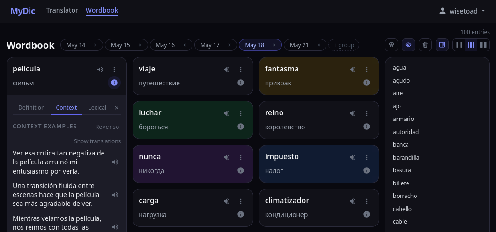

# MyDic

MyDic, a tool for those who keen to dramatically improve their memorization of foreign words.



Some non-obvious UI features:
- Long-pressing the swap button clears the input text along with language swapping
- Long-pressing an audio button pops up the voice selection menu
- After the playback, the audio button switches to slow-pronunciation (yellow) mode
- A small button appearing below selected text allows you to immediately translate it
- You may tap the word in a card to show/hide translation hint
- You may drag cards in the wordbook to reorder them
- Long-pressing a group tab in the wordbook switches it to name editing mode
- Dragging a group in the wordbook onto some word, (re)assigns this group to this word
- Clicking the group label in a card activates filtering by this group

Some usage notes for languages, you do not familiar enough with:

- Translation providers sometimes not so good for single word translation without context. So, always check the translation by switching to different translation providers. Or, read the word definition to grasp it's sense more clearly, in order to understand, whether the translation is suitable for you. The best option is to take some context examples as well.
- The same is for TTS. Generated single-word speech outside it's context (especially on slower rates) may prodice artifacts. So, the best bet is to listen some context examples, in which your word of interest will be pronounced more properly and naturally.


## INSTALLATION

#### Add a new user and dirs:
```sh
sudo useradd -r -d /opt/mydic -s /usr/sbin/nologin mydic

sudo mkdir -p /opt/mydic
cd /opt/mydic

sudo mkdir -p data/db data/lt data/tts/cache
sudo mkdir -p data/tts/piper/voices
sudo mkdir -p data/tts/kokoro/.cache data/tts/kokoro/models

sudo chown -R mydic:mydic data/db data/lt data/tts
```

Optional, but desirable step for running some maintenance scripts without `sudo`:
```sh
sudo usermod -aG mydic {YOURUSER}
```

#### Deploy package:
```sh
wget -qO - https://github.com/WiseToad/mydic/releases/latest/download/mydic.tar.gz \
| sudo tar -xzf -

sudo chgrp mydic scripts/piper-voices.py scripts/users.sh
```

### Service Configuration

```sh
sudo cp .env.sample .env
```
Edit all TODOs in `.env` file.

Some containerized providers are quite resource consuming. If you deploy your services onto a resource-limited environment, you may disable launch of such containers. To do so, remove these providers from `COMPOSE_PROFILES` comma-separated list in the `.env` file. And set corresponding `{PROVIDER}_ENABLED` variables for these providers to `false` as well.

To estimate resources needed for some specific provider, refer to it's documentation.

### Service Startup

```sh
docker compose up -d
```

At first startip, it takes some time to build backend and download models.

### Nginx Configuration

Setup reverse proxy with WebSocket support:
```nginx
...
client_max_body_size 10M;

location / {
    proxy_pass http://localhost:8080; # from FRONTEND_EXPOSE in app's .env

    proxy_set_header Host $host;
    proxy_set_header X-Real-IP $remote_addr;
    proxy_set_header X-Forwarded-For $proxy_add_x_forwarded_for;
}
...
```

### Application Users

If self-registration is disabled (see `REGISTRATION_ENABLED` variable in `.env` file), then add users by hand:

```sh
/opt/mydic/scripts/users.sh add USER [--password PASS]
```

### Piper TTS Voices

Download voices for piper TTS:  
```sh
# For help, run: scripts/piper-voices.py [COMMAND] -h
# or, see the description at the top of scripts/piper-voices.py file
cd /opt/mydic
sudo -u mydic -g mydic scripts/piper-voices.py list --update
sudo -u mydic -g mydic scripts/piper-voices.py download --langs LANG ... [--type {all,medium,high}]
```
sudo options -u and -g are required for file ownership consistency within `data` directory

### TTS Encoder Service

Install background TTS encoder systemd service:
```sh
cd /etc/systemd/system
sudo ln -s /opt/mydic/systemd/encode-tts.service
sudo ln -s /opt/mydic/systemd/encode-tts.timer

sudo systemctl daemon-reload
sudo systemctl enable encode-tts.timer --now

# Inspect job status and logs:
sudo systemctl status encode-tts
sudo journalctl -u encode-tts
```

## UPGRADE

In order to upgrade to a new version, do the following.

#### Stop services:
```sh
cd /opt/mydic
docker compose down

sudo systemctl stop encode-tts.timer
```

#### Cleanup:
```sh
sudo rm -rf backend frontend scripts systemd
```

#### Deploy package:

See "Deploy package" instructions in installation section above.

#### Start services:
```sh
cd /opt/mydic
docker compose up -d --build

sudo systemctl daemon-reload
sudo systemctl start encode-tts.timer
```

## DEVELOPMENT

### Project Setup

```sh
cp .env.dev-sample .env
cp compose.yaml.dev compose.yaml
```

Edit all TODOs in `.env` file.

```sh
docker compose up -d
```

Download Piper TTS voices, if needed, as described above in installation instructions.

Follow setup instructions from README in `backend` and `frontend` subdirs.

### Startup and Usage

Follow startup and usage instructions from README in `backend` and `frontend` subdirs.  
Starting backend and frontend in separate consoles will cleanly provide their logs in runtime.

## RELEASE

First, do not forget to change version number in `VERSION.txt` file before release!

Then, in order to build release package, do:
```sh
./build.sh
```

Target archive is in `build` subdir.
